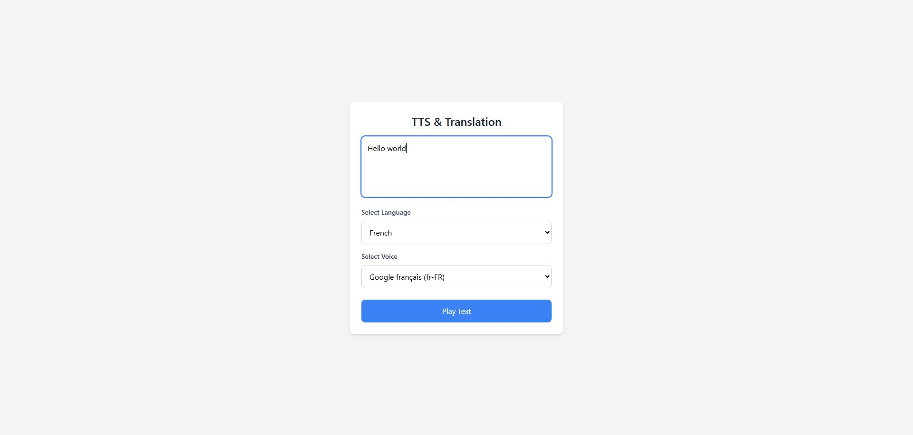

# TTS Translation Web App 🌍🔊

[This is an external link to genome.gov](https://translation-app-red.vercel.app/)

Welcome to the TTS Translation Web App! 🎉

This app allows you to translate text and listen to it in different languages using Text-to-Speech (TTS). Simply enter text, select the language, and listen to the translation. 🎧🌐

### Features:
- **Google Cloud Console Translate API** 🌍: Translate text into multiple languages.
- **Web Speech API** 🗣️: Listen to translations with TTS support.
- **Vercel CLI** 🚀: Deployed seamlessly on Vercel.
- **Serverless Functions** ⚡: Fast and scalable functions for processing translations.

### How to Use:
1. Enter the text you want to translate ✍️.
2. Select your desired language 🌎.
3. Hit "Translate" and listen to it 🔊.

Enjoy the app! 😄

